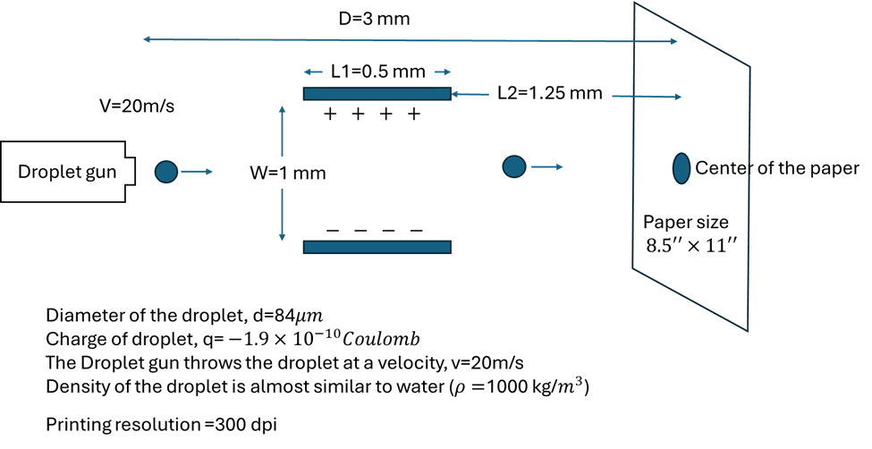

ECGR 3120: Project Description

Instructor: **Dr. Soumitra R Joy**

Total Marks: **70**

## Submission Rules:

It is a group project, each group consists of no more than three people.
You can use Python, MATLAB, or any other convenient platform for script writing and animation. Create a video demonstration of the project, and narrate the video, and upload in youtube. Upload all of your scripts in Github.
Submit a pdf containing the project report, a link to your Youtube Video demonstration and a link to your Github scripts. Add a cover page. The cover should mention the name of the group members.

The project has 5 parts. Part 1,2,3 should be submitted by November 10.  Part 4,5 should be submitted by December 5.

## Description
An inkjet printer is shooting charged droplet towards a letter size paper. A capacitor is placed along its path so as to control the direction of motion of the droplet. Assume that, if a voltage V is applied across the capacitor, then the field E inside of the capacitor would be V=EW. The electric field E will add a vertical component of velocity (Vy) on the droplet  according to the equation: $V_y= a_y T$ . Here T is the time the droplet spends inside the capacitor, and is the vertical acceleration of the droplet, $a_y = \frac{F}{m} = \frac{qE}{m}$ . Here m is the mass of the droplet, and q is the charge of droplet.

The time T that the droplet spends inside the capacitor can be determined by this relation: $L1=V_x T$, where $V_x$ is the horizontal velocity of the droplet, and L1 is the length of the capacitor.

Therefore, the velocity of the droplet, after it exits the capacitor would be $V= \sqrt{V_x^2 + V_y^2}$. After it exits the capacitor, no further change of velocity will occur, assuming the effect of gravity is negligible.

 
## Requirements/Steps
1. Simulate the motion of the droplet when no voltage is applied across the capacitor. How much time would it take for the droplet to reach the center of the paper? 
**Points = 5**
2. Simulate the act of drawing a vertical line (similar to the letter “I” ) along the center of the paper at 300 dpi resolution. How much time would it take to draw the letter ‘I’?
**Points = 10**
3. Plot the profile of applied voltage V(t) across the capacitor versus the time t for drawing the letter ‘I’. This profile of V(t) should look like a staircase. V(t) will remain constant until a droplet exits the capacitor chamber, and immediately it will switch to the next value in order to control the next incoming droplet. How big the letter ‘I’ could be drawn on the paper?
**Points = 10**

4. Resimulate the act of drawing letter ‘I’ as big as possible consuming as small time as possible for each of the following adjustment of the parameter:

    a. The distance between the capacitor and the paper L2 is threefold increased, and everything else remains same

    b. L1 is twofold increased, and everything else remains same

    c. Droplet diameter is tenfold increased, and everything else remains same

    d. The horizontal speed at which the gun shoots the droplet is twofold increased, and everything else remains same

    e. The charge of the droplet is fivefold increased, and everything else remains same.
Plot the profile of applied voltage V(t) versus time t.
**Points = 20**

5. If you want to draw the letter ‘H’ on the paper, you have to add an additional capacitor to impose a velocity component to the droplet. Design the additional capacitor to draw the biggest possible ‘H’ on the paper.  You have to decide the design parameter of the capacitors to draw the ‘H’ shape (length, width of the capacitor plates, and their spacing). Simulate the entire process of drawing the biggest possible ‘H’ shape in 300 dpi resolution. Plot the voltage profile V(t) applied across the capacitor vs time t for both the capacitor. Both the voltage profile would look like a staircase.
**Points = 25**